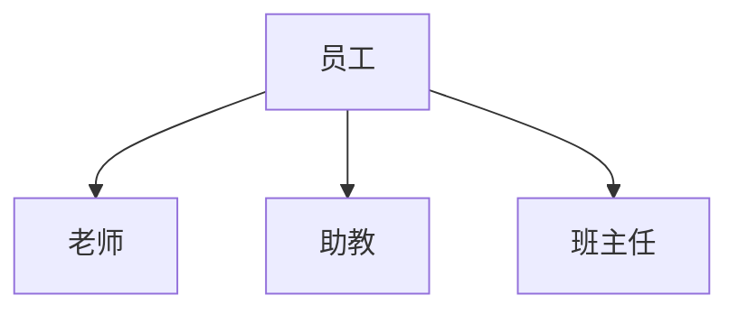
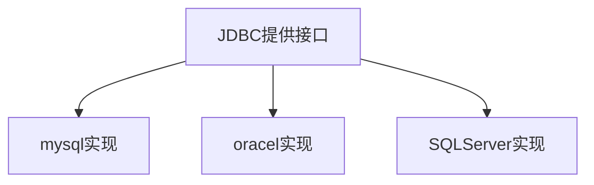

## 一、java数据类型

1. 基本类型4类8种

   byte1 boolean1 char2 short2 int4 float4 long8 double 8 

2. 引用类型 地址

​     String,数组，集合ArrayList,Scanner,Random,自定义类型

##二、String中的方法(4532)

判断方法：

`boolean equals(Strign str)`;比较两个字符串的内容是否相等

` boolean equalsIgnoreCase(String str)`;//比较两个字符串的内容是否相等

`boolean startsWith(String subStr)`//判断某个字符串是否以指定的子串开头

`boolean endsWith(String subStr)`//判断某个字符串是否以指定的子串结尾


获取方法：

`int length()`;//获取长度

`char charAr(int index)`//获取某一个字符

`String substring(int startIndex,int endIndex)`//从指定下标开始截取字符串，到endIndex ,第二个参数不传时，默认是字符串的Length 左闭右开

`int indexOf(String subStr)`//获取子串第一次出现的下标


转换方法

`String toLowerCase(String s)`

`String toUpperCase(String s)`

`Char[] toCharArray()`;变成字符数组


其他方法

`String trim()`;去除字符串两端方法

`String[] split(String str)` //切割字符串

==打印字符数组==

##三、I/O流

字节流 读写文件

输出流：数据从java程序到文件中

输入流：数据从文件到java程序

```sequence
java程序->文件:输出
文件->java程序:输入
```

FileWriter:文件的`字符`输出流

FileReader:文件的`字符`输入流

`fw=new FileWriter(path)`

5个方法

write(int ch);//ASCII

write(char[] chs);

write(String s);

write(char[] chs,int startIndex,int len)写一个字符数组的一部分

write(String s,int startIndex,int len)//写一个字符串的一部分

`fw.close()`//结束


`fr = new FileReader()`

int read()//读取一个字符ASCII

int len=read(char[] chs)//读取一个字符数组

##四、面向对象

1. 什么叫面向对象 一种编程思想 面向对象：遇到一个问题，找对象，调用对象的方法解决问题

2. 类

   1. 封装(隐藏实现细节，对外暴露访问方式) 

   2. 构造

      无参构造*必须有

      全参构造

##五、对象内存表示

idea快速生成构造函数 get/set

eclipse 是alt+shift+s r

引用类型变量的内存

`Dog wangcai=new Dog();`

`Dog wangcai2=new Dog(2000,"wang");`

java中的内存：5部分

本地方法栈：调用操作系统功能，在本地方法栈中

寄存器区：和操作系统相关

1.方法区内加载.class文件

2.jvm执行main方法，main方法入栈


##六、this关键字的使用

作用：

1. 区分局部变量和成员变量 

this的本质，实际上是一个对象，`谁调用的方法，this指的就是谁`


## 七 匿名对象

在开发中可用可不用

```java
//只创建对象，不用变量来接受
new Dog();
new Dog().chishi();
    
```

## 八、继承

语法：

```java
class Super{
    constructor(name,age){
        
    }
}
class Sub extends Super{
    
}
```

==子类继承了父类，子类会自动拥有父类中所有的成员(成员变量和成员方法，private修饰的除外)==





```java
public class Employee{
    String name;
    int age;
    int id;
    //方法
    public void work(){
        sout("正在努力干活");
    }
}
public class Teacher extends Employee{
    
}
public class HelpTeacher extends Employee{
    
}
```


继承注意事项：

* 继承的合理性（人是人他妈生的，妖是妖他妈生的） is a    Dog is a Animal
* 父类中的成员（变量、方法）是共性的内容，子类可以在父类的基础上拓展新的属性
* 子类自动拥有父类的成员并且可以使用非私有的父类成员


---

#JDBC

> jdbc是java访问数据库的标志规范，可以为不同的关系型数据库提供统一的访问接口。主要由接口(大部分)和类组成

数据库驱动

驱动：是实现类




在JDBC中核心的三个接口和一个类

`DriverManager`:加载各种驱动

`Connection`数据库连接接口，实现类在驱动中

`Statement`:接口，执行SQL语句的接口，实现类在驱动中

`ResultSet`:结果集接口，实现类在驱动中


操作数据库步骤

```java
public static void main(String[] args) throws Exception{
    //1.注册驱动，使用DriverManager来注册
    Class.forName("com.mysql.jdbc.Driver");
//    com.mysql.jdbc.Driver drive=new com.mysql.jdbc.Driver();
    DriverManager.registerDriver(drive);
    //2.获取数据库的链接对象Connection接口的实现对象
    String url="jdbc:mysql://localhost:3306/mysql_crash_course";
    Connection conn =DriverManager.getConnection(url,"root","313265@mysqL");
    //3.获取SQL语句的执行者对象，是Statement接口的实现类对象
    Statement st=conn.createStatement();
    //结果集对象：是ResultSet接口的实现类对象
    ResultSet rs=st.executeQuery("select * from customers");
    //5.处理结果集(打印，保存)，迭代器hasNext next
    while(rs.next()){
        
    }
      
}
```


