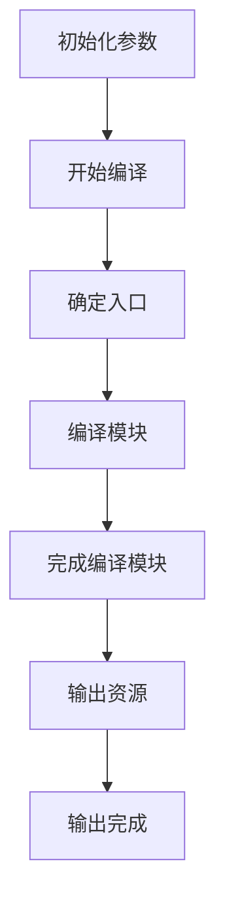
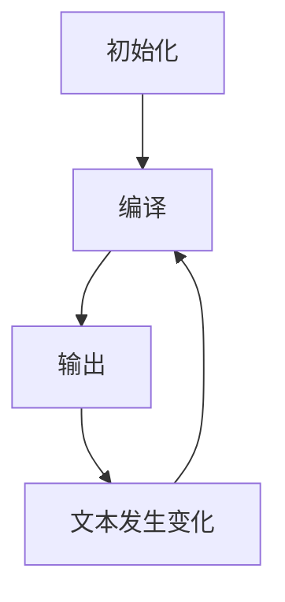

# webpack原理解读

> 本文抄自《深入浅出webpack》，完全手打，建议想学习原理的手打一遍，操作一遍，给别人讲一遍，然后就会了
>
> 在阅读前希望您已有webpack相关的实践经验，不然读了也读不懂
>
> 本文阅读需要几分钟，理解需要自己动手操作蛮长时间

## 0 配置文件

首先简单看一下webpack配置文件(webpack.config.js):

```js
var path = require('path');
var node_modules = path.resolve(__dirname, 'node_modules');
var pathToReact = path.resolve(node_modules, 'react/dist/react.min.js');

module.exports = {
  // 入口文件，是模块构建的起点，同时每一个入口文件对应最后生成的一个 chunk。
  entry: {
    bundle: [
      'webpack/hot/dev-server',
      'webpack-dev-server/client?http://localhost:8080',
      path.resolve(__dirname, 'app/app.js')
    ]
  },
  // 文件路径指向(可加快打包过程)。
  resolve: {
    alias: {
      'react': pathToReact
    }
  },
  // 生成文件，是模块构建的终点，包括输出文件与输出路径。
  output: {
    path: path.resolve(__dirname, 'build'),
    filename: '[name].js'
  },
  // 这里配置了处理各模块的 loader ，包括 css 预处理 loader ，es6 编译 loader，图片处理 loader。
  module: {
    loaders: [
      {
        test: /\.js$/,
        loader: 'babel',
        query: {
          presets: ['es2015', 'react']
        }
      }
    ],
    noParse: [pathToReact]
  },
  // webpack 各插件对象，在 webpack 的事件流中执行对应的方法。
  plugins: [
    new webpack.HotModuleReplacementPlugin()
  ]
};
```


## 1. 工作原理概述

### 1.1 基本概念

在了解webpack原理之前，需要掌握以下几个核心概念

* Entry: 入口，webpack构建第一步从entry开始
* module:模块，在webpack中一个模块对应一个文件。webpack会从entry开始，递归找出所有依赖的模块
* Chunk：代码块，一个chunk由多个模块组合而成，用于代码合并与分割
* Loader: 模块转换器，用于将模块的原内容按照需求转换成新内容
* Plugin:拓展插件，在webpack构建流程中的特定时机会广播对应的事件，插件可以监听这些事件的发生，在特定的时机做对应的事情

### 1.2 流程概述

webpack从启动到结束依次执行以下操作：



各个阶段执行的操作如下：

1. 初始化参数：从配置文件(默认webpack.config.js)和shell语句中读取与合并参数，得出最终的参数
2. 开始编译(compile)：用上一步得到的参数初始化Comiler对象，加载所有配置的插件，通过执行对象的run方法开始执行编译
3. 确定入口：根据配置中的entry找出所有的入口文件
4. 编译模块：从入口文件出发，调用所有配置的Loader对模块进行翻译,再找出该模块依赖的模块，再递归本步骤直到所有入口依赖的文件都经过处理
5. 完成编译模块：经过第四步之后，得到了每个模块被翻译之后的最终内容以及他们之间的依赖关系
6. 输出资源：根据入口和模块之间的依赖关系，组装成一个个包含多个模块的chunk，再将每个chunk转换成一个单独的文件加入输出列表中，这是可以修改输出内容的最后机会
7. 输出完成：在确定好输出内容后，根据配置(webpack.config.js && shell)确定输出的路径和文件名，将文件的内容写入文件系统中(fs)

在以上过程中，webpack会在特定的时间点广播特定的事件，插件监听事件并执行相应的逻辑，并且插件可以调用webpack提供的api改变webpack的运行结果


### 1.3 流程细节

webpack构建流程可分为以下三大阶段。

1. 初始化：启动构建，读取与合并配置参数，加载plugin,实例化Compiler
2. 编译：从Entry出发，针对每个Module串行调用对应的Loader去翻译文件中的内容，再找到该Module依赖的Module，递归的进行编译处理
3. 输出：将编译后的Module组合成Chunk,将Chunk转换成文件，输出到文件系统中

如果只执行一次，流程如上，但在开启监听模式下，流程如下图



#### 1.3.1初始化阶段

在初始化阶段会发生的事件如下

| 事件              | 描述                                                         |
| ----------------- | ------------------------------------------------------------ |
| 初始化参数        | 从配置文件和shell语句中读取与合并参数，得出最终的参数，这个过程还会执行配置文件中的插件实例化语句 new Plugin() |
| 实例化Compiler    | 实例化Compiler,传入上一步得到的参数，Compiler负责文件监听和启动编译。在Compiler实例中包含了完整的webpack配置，全局只有一个Compiler实例。 |
| 加载插件          | 依次调用插件的apply方法，让插件可以监听后续的所有事件节点。同时向插件中传入compiler实例的引用，以方便插件通过compiler调用webpack的api |
| environment       | 开始应用Node.js风格的文件系统到compiler对象，以方便后续的文件寻找和读取 |
| Entry-option      | 读取配置的Entrys,为每个Entry实例化一个对应的EntryPlugin,为后面该Entry的递归解析工作做准备 |
| After-plugins     | 调用完所有内置的和配置的插件的apply方法                      |
| After-resolvers   | 根据配置初始化resolver,resolver负责在文件系统中寻找指定路径的文件 |


 #### 1.3.2 编译阶段 (事件名全为小写)

| 事件          | 解释                                                         |
| ------------- | ------------------------------------------------------------ |
| run           | 启动一次编译                                                 |
| Watch-run     | 在监听模式下启动编译，文件发生变化会重新编译                 |
| compile       | 告诉插件一次新的编译将要启动，同时会给插件带上compiler对象   |
| compilation   | 当webpack以开发模式运行时，每当检测到文件的变化，便有一次新的compilation被创建。一个Compilation对象包含了当前的模块资源、编译生成资源、变化的文件等。compilation对象也提供了很多事件回调给插件进行拓展 |
| make          | 一个新的compilation对象创建完毕,即将从entry开始读取文件,根据文件类型和编译的loader对文件进行==编译==,编译完后再找出该文件依赖的文件,递归地编译和解析 |
| after-compile | 一次compilation执行完成                                      |
| invalid       | 当遇到错误会触发改事件,该事件不会导致webpack退出             |
|               |                                                              |

在编译阶段最重要的事件是compilation,因为在compilation阶段调用了Loader,完成了每个模块的==转换==操作。在compilation阶段又会发生很多小事件，如下表

| 事件                 | 解释                                                         |
| -------------------- | ------------------------------------------------------------ |
| build-module         | 使用相应的Loader去转换一个模块                               |
| Normal-module-loader | 在使用loader转换完一个模块后，使用[acorn](https://github.com/acornjs/acorn)解析转换后的内容，输出对应的抽象语法树（AST），以方便webpack对代码进行分析 |
| program              | 从配置的入口模块开始，分析其AST,当遇到require等导入其他模块的语句时，便将其加入依赖的模块列表中，同时对于新找出来的模块递归分析，最终弄清楚所有模块的依赖关系 |
| seal                 | 所有模块及依赖的模块都通过Loader转换完成，根据依赖关系生成Chunk |
|                      |                                                              |

#### 2.3 输出阶段

输出阶段会发生的事件及解释:

| 事件        | 解释                                                         |
| ----------- | ------------------------------------------------------------ |
| should-emit | 所有需要输出的文件已经生成,询问插件有哪些文件需要输出,有哪些不需要输出 |
| emit        | 确定好要输出哪些文件后,执行文件输出,==可以在这里获取和修改输出的内容== |
| after-mit   | 文件输出完毕                                                 |
| done        | 成功完成一次完整的编译和输出流程                             |
| failed      | 如果在编译和输出中出现错误,导致webpack退出,就会直接跳转到本步骤,插件可以在本事件中获取具体的错误原因 |

在输出阶段已经得到了各个模块经过转化后的结果和其依赖关系,并且将相应的模块组合在一起形成一个个chunk.在输出阶段根据chunk的类型,使用对应的模板生成最终要输出的文件内容. |


```js
//以下代码用来包含webpack运行过程中的每个阶段
//file:webpack.config.js

const path = require('path');
//插件监听事件并执行相应的逻辑
class TestPlugin {
  constructor() {
    console.log('@plugin constructor');
  }

  apply(compiler) {
    console.log('@plugin apply');

    compiler.plugin('environment', (options) => {
      console.log('@environment');
    });

    compiler.plugin('after-environment', (options) => {
      console.log('@after-environment');
    });

    compiler.plugin('entry-option', (options) => {
      console.log('@entry-option');
    });

    compiler.plugin('after-plugins', (options) => {
      console.log('@after-plugins');
    });

    compiler.plugin('after-resolvers', (options) => {
      console.log('@after-resolvers');
    });

    compiler.plugin('before-run', (options, callback) => {
      console.log('@before-run');
      callback();
    });

    compiler.plugin('run', (options, callback) => {
      console.log('@run');
      callback();
    });

    compiler.plugin('watch-run', (options, callback) => {
      console.log('@watch-run');
      callback();
    });

    compiler.plugin('normal-module-factory', (options) => {
      console.log('@normal-module-factory');
    });

    compiler.plugin('context-module-factory', (options) => {
      console.log('@context-module-factory');
    });

    compiler.plugin('before-compile', (options, callback) => {
      console.log('@before-compile');
      callback();
    });

    compiler.plugin('compile', (options) => {
      console.log('@compile');
    });

    compiler.plugin('this-compilation', (options) => {
      console.log('@this-compilation');
    });

    compiler.plugin('compilation', (options) => {
      console.log('@compilation');
    });

    compiler.plugin('make', (options, callback) => {
      console.log('@make');
      callback();
    });

    compiler.plugin('compilation', (compilation) => {

      compilation.plugin('build-module', (options) => {
        console.log('@build-module');
      });

      compilation.plugin('normal-module-loader', (options) => {
        console.log('@normal-module-loader');
      });

      compilation.plugin('program', (options, callback) => {
        console.log('@program');
        callback();
      });

      compilation.plugin('seal', (options) => {
        console.log('@seal');
      });
    });

    compiler.plugin('after-compile', (options, callback) => {
      console.log('@after-compile');
      callback();
    });

    compiler.plugin('should-emit', (options) => {
      console.log('@should-emit');
    });

    compiler.plugin('emit', (options, callback) => {
      console.log('@emit');
      callback();
    });

    compiler.plugin('after-emit', (options, callback) => {
      console.log('@after-emit');
      callback();
    });

    compiler.plugin('done', (options) => {
      console.log('@done');
    });

    compiler.plugin('failed', (options, callback) => {
      console.log('@failed');
      callback();
    });

    compiler.plugin('invalid', (options) => {
      console.log('@invalid');
    });

  }
}
```

```shell
#在目录下执行
webpack
#输出以下内容
@plugin constructor
@plugin apply
@environment
@after-environment
@entry-option
@after-plugins
@after-resolvers
@before-run
@run
@normal-module-factory
@context-module-factory
@before-compile
@compile
@this-compilation
@compilation
@make
@build-module
@normal-module-loader
@build-module
@normal-module-loader
@seal
@after-compile
@should-emit
@emit
@after-emit
@done
Hash: 19ef3b418517e78b5286
Version: webpack 3.11.0
Time: 95ms
    Asset     Size  Chunks             Chunk Names
bundle.js  3.03 kB       0  [emitted]  main
   [0] ./main.js 44 bytes {0} [built]
   [1] ./show.js 114 bytes {0} [built]
```

## 2 输出文件分析

### 2.1 举个栗子

下面通过 Webpack 构建一个采用 CommonJS 模块化编写的项目，该项目有个网页会通过 JavaScript 在网页中显示 `Hello,Webpack`。

运行构建前，先把要完成该功能的最基础的 JavaScript 文件和 HTML 建立好，需要如下文件：

页面入口文件 `index.html`

```html
<html>
<head>
  <meta charset="UTF-8">
</head>
<body>
<div id="app"></div>
<!--导入 Webpack 输出的 JavaScript 文件-->
<script src="./dist/bundle.js"></script>
</body>
</html>
```

JS 工具函数文件 `show.js`

```js
// 操作 DOM 元素，把 content 显示到网页上
function show(content) {
  window.document.getElementById('app').innerText = 'Hello,' + content;
}

// 通过 CommonJS 规范导出 show 函数
module.exports = show;
```

JS 执行入口文件 `main.js`

```js
// 通过 CommonJS 规范导入 show 函数
const show = require('./show.js');
// 执行 show 函数
show('Webpack');
```

Webpack 在执行构建时默认会从项目根目录下的 `webpack.config.js` 文件读取配置，所以你还需要新建它，其内容如下：

```js
const path = require('path');

module.exports = {
  // JavaScript 执行入口文件
  entry: './main.js',
  output: {
    // 把所有依赖的模块合并输出到一个 bundle.js 文件
    filename: 'bundle.js',
    // 输出文件都放到 dist 目录下
    path: path.resolve(__dirname, './dist'),
  }
};
```

由于 Webpack 构建运行在 Node.js 环境下，所以该文件最后需要通过 CommonJS 规范导出一个描述如何构建的 `Object` 对象。

```
|-- index.html
|-- main.js
|-- show.js
|-- webpack.config.js
```

一切文件就绪，在项目根目录下执行 `webpack` 命令运行 Webpack 构建，你会发现目录下多出一个 `dist`目录，里面有个 `bundle.js` 文件， `bundle.js` 文件是一个可执行的 JavaScript 文件，它包含页面所依赖的两个模块 `main.js` 和 `show.js` 及内置的 `webpackBootstrap` 启动函数。 这时你用浏览器打开 `index.html` 网页将会看到 `Hello,Webpack`。

### 2.2 bundle.js文件做了什么

看之前记住：一个模块就是一个文件，

首先看下bundle.js长什么样子：


注意：序号1处是个自执行函数，序号2作为自执行函数的参数传入

具体代码如下：（建议把以下代码放入编辑器中查看，最好让index.html执行下，弄清楚执行的顺序）

```js
(function(modules) { // webpackBootstrap
  // 1. 缓存模块
  var installedModules = {};
  // 2. 定义可以在浏览器使用的require函数
  function __webpack_require__(moduleId) {

    // 2.1检查模块是否在缓存里，在的话直接返回
    if(installedModules[moduleId]) {
      return installedModules[moduleId].exports;
    }
    // 2.2 模块不在缓存里，新建一个对象module=installModules[moduleId] {i:moduleId,l:模块是否加载,exports:模块返回值}
    var module = installedModules[moduleId] = {
      i: moduleId,//第一次执行为0
      l: false,
      exports: {}
    };//第一次执行module:{i:0,l:false,exports:{}}
    // 2.3 执行传入的参数中对应id的模块 第一次执行数组中传入的第一个参数
      	//modules[0].call({},{i:0,l:false,exports:{}},{},__webpack_require__函数)
    modules[moduleId].call(module.exports, module, module.exports, __webpack_require__);
    // 2.4 将这个模块标记为已加载
    module.l = true;
    // 2.5 返回这个模块的导出值
    return module.exports;
  }
  // 3. webpack暴露属性 m c d n o p
  __webpack_require__.m = modules;
  __webpack_require__.c = installedModules;
  __webpack_require__.d = function(exports, name, getter) {
    if(!__webpack_require__.o(exports, name)) {
      Object.defineProperty(exports, name, {
        configurable: false,
        enumerable: true,
        get: getter
      });
    }
  };
  __webpack_require__.n = function(module) {
    var getter = module && module.__esModule ?
      function getDefault() { return module['default']; } :
      function getModuleExports() { return module; };
    __webpack_require__.d(getter, 'a', getter);
    return getter;
  };
  __webpack_require__.o = function(object, property) { return Object.prototype.hasOwnProperty.call(object, property); };
  __webpack_require__.p = "";
  // 4. 执行reruire函数引入第一个模块(main.js对应的模块)
  return __webpack_require__(__webpack_require__.s = 0);
})
([ // 0. 传入参数，参数是个数组

  /* 第0个参数 main.js对应的文件*/
  (function(module, exports, __webpack_require__) {

    // 通过 CommonJS 规范导入 show 函数
    const show = __webpack_require__(1);//__webpack_require__(1)返回show
    // 执行 show 函数
    show('Webpack');

  }),
  /* 第1个参数 show.js对应的文件 */
  (function(module, exports) {

    // 操作 DOM 元素，把 content 显示到网页上
    function show(content) {
      window.document.getElementById('app').innerText = 'Hello,' + content;
    }
    // 通过 CommonJS 规范导出 show 函数
    module.exports = show;

  })
]);
```

以上看上去复杂的代码其实是一个自执行函数(文件作为自执行函数的参数)，可以简写如下：

```js
(function(modules){
    //模拟require语句
    function __webpack_require__(){}
    //执行存放所有模块数组中的第0个模块(main.js)
    __webpack_require_[0]
})([/*存放所有模块的数组*/])
```


bundles.js能直接在浏览器中运行的原因是，在输出的文件中通过`__webpack_require__`函数,定义了一个可以在浏览器中执行的加载函数(加载文件使用ajax实现),来模拟Node.js中的require语句。

原来一个个独立的模块文件被合并到了一个单独的 bundle.js 的原因在于浏览器不能像 Node.js 那样快速地去本地加载一个个模块文件，而必须通过网络请求去加载还未得到的文件。 如果模块数量很多，加载时间会很长，因此把所有模块都存放在了数组中，执行一次网络加载。


修改main.js,改成import引入模块

```js
import show from './show';
show('Webpack');
```

在目录下执行`webpack`，会发现：

1. 生成的代码会有所不同，但是主要的区别是自执行函数的参数不同，也就是2.2代码的第二部分不同

```js
([//自执行函数和上面相同，参数不同
/* 0 */
(function(module, __webpack_exports__, __webpack_require__) {

"use strict";
Object.defineProperty(__webpack_exports__, "__esModule", { value: true });
/* harmony import */ var __WEBPACK_IMPORTED_MODULE_0__show__ = __webpack_require__(1);

Object(__WEBPACK_IMPORTED_MODULE_0__show__["a" /* default */])('Webpack');


}),
/* 1 */
(function(module, __webpack_exports__, __webpack_require__) {

"use strict";
/* harmony export (immutable) */ __webpack_exports__["a"] = show;
function show(content) {
  window.document.getElementById('app').innerText = 'Hello,' + content;
}


})
]);
```

参数不同的原因是es6的import和export模块被webpack编译处理过了,其实作用是一样的，接下来看一下在main.js中异步加载模块时，bundle.js是怎样的

### 2.3异步加载时，bundle.js代码分析

`main.js`修改如下

```js
import('./show').then(show=>{
    show('Webpack')
})
```

构建成功后会生成两个文件

1. bundle.js  执行入口文件
2. 0.bundle.js 异步加载文件

其中0.bundle.js文件的内容如下：

```js
webpackJsonp(/*在其他文件中存放的模块的ID*/[0],[//本文件所包含的模块
/* 0 */,
/* 1 show.js对应的模块 */
(function(module, __webpack_exports__, __webpack_require__) {

  "use strict";
  Object.defineProperty(__webpack_exports__, "__esModule", { value: true });
  /* harmony export (immutable) */ 
  __webpack_exports__["default"] = show;

  function show(content) {
    window.document.getElementById('app').innerText = 'Hello,' + content;
  }

})
]);
```

bundle.js文件的内容如下：

注意：bundle.js比上面的bundle.js的区别在于：

1. 多了一个`__webpack_require__.e`,用于加载被分割出去的需要异步加载的chunk对应的文件
2. 多了一个webpackJsonp函数，用于从异步加载的文件中安装模块 

```js
(function(modules) { // webpackBootstrap
	// install a JSONP callback for chunk loading
  var parentJsonpFunction = window["webpackJsonp"];
  // webpackJsonp用于从异步加载的文件中安装模块
  // 将webpackJsonp挂载到全局是为了方便在其他文件中调用
  /**
   * @param chunkIds 异步加载的模块中需要安装的模块对应的id
   * @param moreModules 异步加载的模块中需要安装模块列表
   * @param executeModules 异步加载的模块安装成功后需要执行的模块对应的index
   */
	window["webpackJsonp"] = function webpackJsonpCallback(chunkIds, moreModules, executeModules) {
		// add "moreModules" to the modules object,
		// then flag all "chunkIds" as loaded and fire callback
		var moduleId, chunkId, i = 0, resolves = [], result;
		for(;i < chunkIds.length; i++) {
			chunkId = chunkIds[i];
			if(installedChunks[chunkId]) {
				resolves.push(installedChunks[chunkId][0]);
			}
			installedChunks[chunkId] = 0;
		}
		for(moduleId in moreModules) {
			if(Object.prototype.hasOwnProperty.call(moreModules, moduleId)) {
				modules[moduleId] = moreModules[moduleId];
			}
		}
		if(parentJsonpFunction) parentJsonpFunction(chunkIds, moreModules, executeModules);
		while(resolves.length) {
			resolves.shift()();
		}
	};
	// The module cache
	var installedModules = {};
	// objects to store loaded and loading chunks
	var installedChunks = {
		1: 0
	};
	// The require function
	function __webpack_require__(moduleId) {
		// Check if module is in cache
		if(installedModules[moduleId]) {
			return installedModules[moduleId].exports;
		}
		// Create a new module (and put it into the cache)
		var module = installedModules[moduleId] = {
			i: moduleId,
			l: false,
			exports: {}
		};
		// Execute the module function
		modules[moduleId].call(module.exports, module, module.exports, __webpack_require__);
		// Flag the module as loaded
		module.l = true;
		// Return the exports of the module
		return module.exports;
	}
	// This file contains only the entry chunk.
  // The chunk loading function for additional chunks
  /**
   * 用于加载被分割出去的需要异步加载的chunk对应的文件
   * @param chunkId 需要异步加载的chunk对应的id
   * @returns {Promise}
   */
	__webpack_require__.e = function requireEnsure(chunkId) {
      var installedChunkData = installedChunks[chunkId];
      if(installedChunkData === 0) {
        return new Promise(function(resolve) { resolve(); });
      }
      // a Promise means "currently loading".
      if(installedChunkData) {
        return installedChunkData[2];
      }
      // setup Promise in chunk cache
      var promise = new Promise(function(resolve, reject) {
        installedChunkData = installedChunks[chunkId] = [resolve, reject];
      });
      installedChunkData[2] = promise;
      // start chunk loading
      var head = document.getElementsByTagName('head')[0];
      var script = document.createElement('script');
      script.type = "text/javascript";
      script.charset = 'utf-8';
      script.async = true;
      script.timeout = 120000;
      if (__webpack_require__.nc) {
        script.setAttribute("nonce", __webpack_require__.nc);
      }
      script.src = __webpack_require__.p + "" + chunkId + ".bundle.js";
      var timeout = setTimeout(onScriptComplete, 120000);
      script.onerror = script.onload = onScriptComplete;
      function onScriptComplete() {
        // avoid mem leaks in IE.
        script.onerror = script.onload = null;
        clearTimeout(timeout);
        var chunk = installedChunks[chunkId];
        if(chunk !== 0) {
          if(chunk) {
            chunk[1](new Error('Loading chunk ' + chunkId + ' failed.'));
          }
          installedChunks[chunkId] = undefined;
        }
      };
      head.appendChild(script);
      return promise;
	};
	// expose the modules object (__webpack_modules__)
	__webpack_require__.m = modules;
	// expose the module cache
	__webpack_require__.c = installedModules;
	// define getter function for harmony exports
	__webpack_require__.d = function(exports, name, getter) {
		if(!__webpack_require__.o(exports, name)) {
			Object.defineProperty(exports, name, {
				configurable: false,
				enumerable: true,
				get: getter
			});
		}
	};
	// getDefaultExport function for compatibility with non-harmony modules
	__webpack_require__.n = function(module) {
		var getter = module && module.__esModule ?
			function getDefault() { return module['default']; } :
			function getModuleExports() { return module; };
		__webpack_require__.d(getter, 'a', getter);
		return getter;
	};
	// Object.prototype.hasOwnProperty.call
	__webpack_require__.o = function(object, property) { return Object.prototype.hasOwnProperty.call(object, property); };
	// __webpack_public_path__
	__webpack_require__.p = "";
	// on error function for async loading
	__webpack_require__.oe = function(err) { console.error(err); throw err; };
	// Load entry module and return exports
	return __webpack_require__(__webpack_require__.s = 0);
})
/************************************************************************/
([//存放没有经过异步加载的，随着执行入口文件加载的模块
/* 0 */
/***/ (function(module, exports, __webpack_require__) {

__webpack_require__.e/* import() */(0).then(__webpack_require__.bind(null, 1)).then(show=>{
    show('Webpack')
})


/***/ })
]);
```

